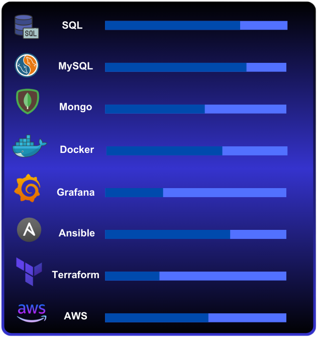

 

</a> 

    

<h2>   Sobre mí </h2>
<pre>
🎓 Estudiante graduado en "Administración de sistemas informaticos" & "Sistemas microinformáticos y redes".
📚 Actualmente me encuentro aprendiendo MongoDB, PL/SQL, SQL Common Table Expression, Oracle y Jenkins.
👩‍💻 En busca activa de empleo en áreas relacionadas con las bases de datos o devops.
💪🏼 Future Goals: Seguir aprendiendo nuevas tecnologías emergentes, para poder aportar valor en el mercado.
⚡ Fun fact: En mis ratos libres me gusta embarcarme en nuevas prácticas y proyectos personales.
</pre>

<h2>  Competencias </h2>

<h2> Estadísticas </h2>

 

 

<h2 align="center" > Conecta conmigo </h2>

              

