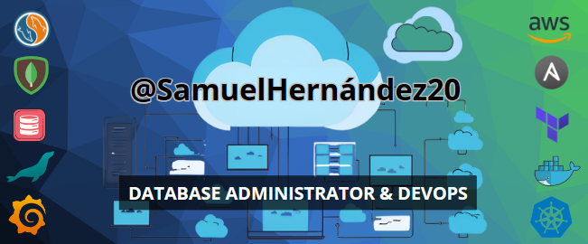

 

</a> 

    

<h2>   Sobre mí </h2>

- 🎓 Estudiante graduado en *Administración de sistemas informaticos* & *Sistemas microinformáticos y redes*.
- 📚 Actualmente me encuentro aprendiendo MongoDB, PL/SQL, SQL Common Table Expression, Oracle y Jenkins.
- 💪🏼 Future Goals: Seguir aprendiendo nuevas tecnologías emergentes, para poder aportar valor en el mercado.
- ⚡ Fun fact: En mis ratos libres me gusta embarcarme en nuevas prácticas y proyectos personales.

<h2>  Competencias </h2>

<h2> Contacto </h2>

